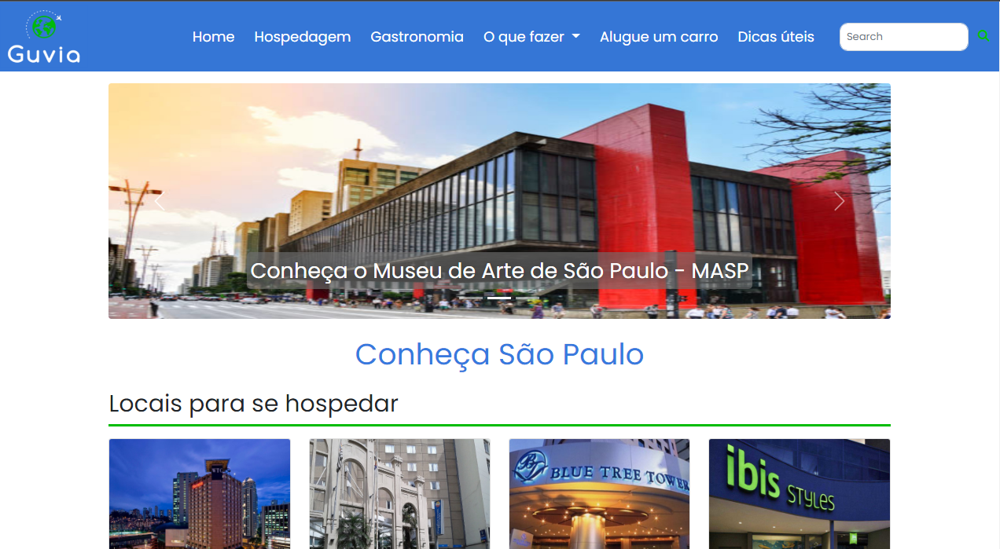

# Projeto Guvia Traveller
> Portal para disponibilizar informações sobre viagens, cultura, história e outras informações uteis aos viajantes.
> 
![b-image]
![css-image] 
![html-image] 
![js-image] 

O projeto Traveller será um portal que irá contemplar informações sobre viagens, cultura e história do lugar, quanto tempo sugestivo para permanecer na cidade (mínimo e máximo), mapas ou aplicativos que podem ajudar na locomoção, e a média de gasto por dia (mínimo e máximo). Se a cidade de destino exige alguma roupa específica, caso seja muito fria. Dicas para comprar roupa apropriada no Brasil, com gráfico comparativo de preços e qualidade, em relação à compra no Brasil ou no destino. Informações úteis como fuso, idioma predominante, bagagem, moeda, voltagem, tipo de tomada, documentos necessários, aluguel de carros e “como chegar”.

## Visualização
> [![Guvia Link][guvia-home]][home-url]
[![Guvia Link][guvia-hosp]][hosp-url]

## Histórico de versões
* 0.0.2
    * Em andamento...

## Contribuições

1. Fork (<https://github.com/AnnylysMedeiros/Projeto_Guvia_FIAP>)
2. Crie seu branch
3. Faça o Commit de suas alterações
4. Faça o push do branch
5. Crie o seu Pull Request

<svg role="img" viewBox="0 0 24 24" xmlns="http://www.w3.org/2000/svg"><title>4chan</title><path d="M11.07 8.82S9.803 1.079 5.145 1.097C2.006 1.109.78 4.124 3.055 4.802c0 0-2.698.973-2.698 2.697 0 1.725 4.274 3.54 10.713 1.32zm1.931 5.924s.904 7.791 5.558 7.991c3.136.135 4.503-2.82 2.262-3.604 0 0 2.74-.845 2.82-2.567.08-1.723-4.105-3.737-10.64-1.82zm-3.672-1.55s-7.532 2.19-6.952 6.813c.39 3.114 3.53 3.969 3.93 1.63 0 0 1.29 2.559 3.002 2.351 1.712-.208 3-4.67.02-10.794zm5.623-2.467s7.727-1.35 7.66-6.008c-.046-3.138-3.074-4.333-3.728-2.051 0 0-1-2.686-2.726-2.668-1.724.018-3.494 4.312-1.206 10.727z"/></svg>

[html-image]: https://img.shields.io/badge/-html-orange?style=flat
[css-image]: https://img.shields.io/badge/-css-blue?style=flat
[js-image]: https://img.shields.io/badge/-JS-yellow?style=flat
[b-image]: https://img.shields.io/badge/-bootstrap-purple?style=flat

<!--- Guvia menu--->
[guvia-home]: https://img.shields.io/badge/-home-blue?style=for-the-badge
[home-url]: https://annylysmedeiros.github.io/Projeto_Guvia_FIAP/index.html

[guvia-hosp]: https://img.shields.io/badge/-hospedagem-blue?style=for-the-badge
[hosp-url]: https://annylysmedeiros.github.io/Projeto_Guvia_FIAP/hospedagem.html
